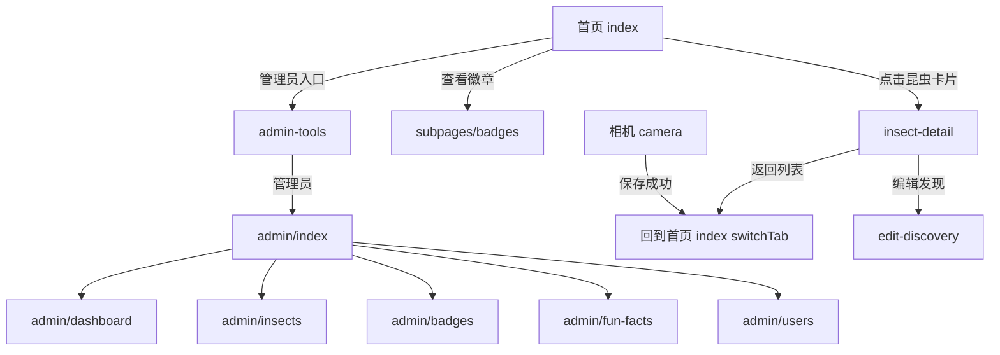

# 昆虫图鉴 - UI 页面导航图

> 最后更新：2026-07-24

## TabBar 入口

```
┌─────────────────────────────────────┐
│           tabBar (底部导航)          │
│                                     │
│  📖 我的图鉴                    📷 发现昆虫 │
│  pages/index/index            pages/camera/camera        │
└─────────────────────────────────────┘
```

---

## 完整页面路由

### 主包页面（pages/）

```
pages/
├── index/index              ← TabBar: 我的图鉴（首页）
│   ├── 展示收藏列表 + 进度条 + 冷知识 + 等级
│   └── 跳转: subpages/insect-detail/insect-detail
│       subpages/badges/badges
│       admin-tools/admin-tools（仅管理员可见）
│
├── camera/camera            ← TabBar: 发现昆虫（拍照识别）
│   ├── 拍照 / 选相册 / 手动输入
│   └── 跳转: pages/index/index（switchTab，保存成功后）
│
├── get-openid/get-openid    ← 调试页面，不推荐用户访问
│
└── admin-tools/admin-tools  ← 管理员工具入口页
    └── 跳转: pages/admin/*（仅管理员）
```

### 子包页面（subpages/）

```
subpages/
├── insect-detail/insect-detail   ← 昆虫详情页
│   ├── 展示百科 + 发现记录列表
│   └── 来源: 首页点击昆虫卡片、admin 后台
│
├── badges/badges                 ← 等级/徽章展示页
│   └── 来源: 首页 "查看徽章"
│
├── discovery/discovery           ← 发现地图页（目前硬编码模拟数据）
│   └── 来源: 需确认是否在 tabBar 或首页有入口
│
└── edit-discovery/edit-discovery ← 编辑发现记录
    └── 来源: 详情页内编辑
```

### Admin 后台页面（pages/admin/）

```
pages/admin/
├── index/index           ← Admin 入口
│   └── 跳转: admin/dashboard, insects, badges, fun-facts, users
│
├── dashboard/dashboard   ← 仪表盘（统计概览）
│
├── insects/insects.js    ← 昆虫管理列表（CRUD）
├── insects/detail-insect.js  ← 昆虫详情编辑
│
├── badges/badges.js      ← 徽章配置管理
├── fun-facts/fun-facts.js ← 冷知识管理
└── users/users.js        ← 用户列表
```

---

## 页面跳转关系图



---

## 权限控制

| 页面 | 访问条件 | 检查方式 |
|------|---------|---------|
| 全部页面 | 所有登录用户 | openid 获取后存储 globalData |
| admin-tools | 管理员 | `checkAdminPermission` 云函数 |
| admin/* | 管理员 | `checkAdminPermission` 云函数 |
| get-openid | 所有用户（调试用） | — |

---

## 子包独立模式

`subpages/` 被标记为 `independent: true`，这意味着它是一个**独立分包**。
每个子包可独立加载和卸载，不会影响主包体积。

当前 subpackages 配置：

```json
{
  "subpackages": [
    {
      "root": "subpages/",
      "pages": [
        "insect-detail/insect-detail",
        "badges/badges",
        "discovery/discovery",
        "edit-discovery/edit-discovery"
      ],
      "independent": true
    }
  ]
}
```

---

## 待确认的 UX 问题

1. **Discovery 页面**：当前是硬编码模拟数据，需要确认是否保留或接入真实后端
2. **admin-tools 可达性**：该页面在 app.json 中注册了路由但不在 tabBar，用户如何触发？当前由首页检测管理员权限后显示"管理"入口
3. **get-openid 页面**：建议隐藏或移除，避免普通用户误入
4. **insect-detail-new.js**：存在 65 行替代实现但未启用，需确认是否废弃
